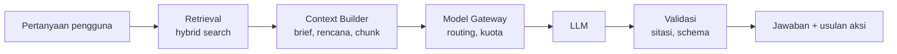

# AI Engine

AI Engine punya empat bagian: **Context Engine**, **AI Workflows**, **Model Gateway**, serta **Guardrails dan Evals**. Aturan dasarnya: LLM memahami dan menulis, kode biasa menghitung dan menyimpan.

Pendekatan dipilih dari yang paling sederhana: prompt biasa → structured output → RAG → agen. MVP memakai structured output, RAG, dan tool calling di chat. Agen otonom menunggu V2.

## Alur satu permintaan chat

Setiap usulan aksi dari chat (tambah task, geser jadwal) disimpan sebagai **Suggestion** dan menunggu persetujuan pengguna.

## AI Workflows di MVP

| Workflow | Pemicu | Konteks yang dibaca | Output | Kelas model |
| --- | --- | --- | --- | --- |
| Intake dan Brief | Project dibuat, dokumen kunci diunggah | Form intake, proposal, instruksi dosen | Brief JSON + pertanyaan terbuka | Kuat |
| Klasifikasi dokumen | Dokumen diunggah | 2 halaman pertama | Jenis dokumen, metadata | Ringan |
| Plan Generator | Brief disetujui | Brief, template mode, kapasitas | Struktur kerja JSON **tanpa tanggal** | Kuat |
| Project Chat | Pesan pengguna | Brief, snapshot rencana, chunk dokumen, memori | Jawaban bersitasi + usulan aksi | Kuat atau ringan |
| Task Helper | Tombol di task | Task, dokumen terkait | Subtask usulan, langkah pertama | Ringan |
| Log bimbingan | Catatan bimbingan disimpan | Catatan, brief, rencana | Item memori + usulan task revisi | Kuat |
| Re-plan | Health turun, deadline berubah | Rencana, progress, hasil simulasi scheduler | Penjelasan 2–3 opsi | Kuat |
| Review mingguan | Jadwal Minggu malam | Aktivitas 7 hari, health | Ringkasan + fokus minggu depan | Ringan, via Batch |

**Titik awal model:** kelas ringan = Claude Haiku 4.5, kelas kuat = Claude Sonnet 5. Model dari provider lain bisa diuji lewat gateway yang sama. Keputusan final diambil dari hasil evals ([[Testing dan Evals]]).

## Context Engine

Prompt dirakit dengan urutan tetap. Bagian yang jarang berubah ditaruh di depan dan bagian yang berubah tiap pesan di belakang. Urutan ini membuat prompt caching bekerja maksimal, dan pertanyaan pengguna selalu berada di posisi terakhir.

| # | Bagian | Budget contoh (token) |
| --- | --- | --- |
| 1 | Instruksi sistem + aturan mode | 1.500 |
| 2 | Definisi tool | 800 |
| 3 | Project Brief | 800 |
| 4 | Snapshot rencana (milestone, task aktif, health) | 1.500 |
| 5 | Memori project yang relevan | 500 |
| 6 | Chunk dokumen hasil retrieval (8 × 500) | 4.000 |
| 7 | Ringkasan dan pesan percakapan terakhir | 3.000 |
| 8 | Pertanyaan pengguna | sisa |

Context window besar (sampai 1 juta token) disimpan untuk tugas berat sesekali, misalnya mereview satu naskah skripsi utuh. Untuk chat harian, konteks ringkas lebih murah, lebih cepat, dan lebih akurat.

**Bahasa:** instruksi sistem perlu memuat bahasa jawaban (Indonesia atau English). Karena bagian ini ada di prefix yang di-cache, setiap bahasa punya prefix cache sendiri. Lihat [[Bilingual ID-EN]].

## Grounding dan sitasi

- Chunk hasil retrieval dikirim sebagai blok *search result* atau dokumen, sehingga Claude memberi sitasi ke kalimat sumber secara otomatis.
- **Citations tidak bisa digabung dengan Structured Outputs.** Citations dipakai untuk tanya-jawab, Structured Outputs untuk Plan Generator.
- Jika skor retrieval di bawah ambang, AI menyatakan informasinya tidak ada di dokumen project dan memberi label jelas pada pengetahuan umum.
- AI hanya mengutip referensi yang ada di library project. Saran referensi baru (V1) diambil dari Crossref, OpenAlex, atau Semantic Scholar dengan metadata terverifikasi.

## Structured output dan tool calling

- Plan Generator mengembalikan JSON sesuai schema Pydantic. Backend lalu memvalidasi: graf dependensi tanpa siklus, estimasi 0,5–40 jam per task, dan setiap task menunjuk milestone yang ada. Validasi gagal → satu kali retry berisi pesan error → fallback ke rencana template.
- Tool baca berjalan otomatis: `get_brief`, `list_tasks`, `search_documents`, `get_progress`.
- Tool tulis selalu menghasilkan Suggestion: `propose_changes`, `add_note`.

## Model Gateway

- Satu pintu masuk, misalnya `complete(task_type, messages, schema=None)`. Tabel routing memetakan `task_type` ke model dan batas token.
- Timeout 60 detik. Error 429 dan 5xx di-retry dengan exponential backoff, dan ada model cadangan.
- Setiap panggilan mencatat pengguna, project, jenis tugas, model, token masuk/keluar, cache hit, latensi, dan estimasi biaya. Semuanya masuk tabel `usage_ledger`.
- Kuota dicek sebelum panggilan. Pengguna yang kuotanya habis melihat pesan jelas plus kapan kuotanya pulih.

## Kendali biaya

- Prompt caching untuk prefix stabil (instruksi, tool, brief).
- Batch API untuk pekerjaan tidak mendesak (review mingguan, ringkasan ulang), biayanya 50% lebih murah.
- Model ringan untuk klasifikasi, ekstraksi, dan ringkasan.
- Batas keras: token maksimal per permintaan, kredit bulanan per pengguna, rate limit per menit, alarm anggaran di dashboard provider.

Hitungan biaya per pengguna ada di [[Monetisasi]].

## Guardrails

- Teks dokumen unggahan diperlakukan sebagai data. Instruksi sistem menegaskan bahwa perintah di dalam dokumen bukan perintah untuk AI. Semua aksi tulis tetap butuh persetujuan.
- Output model dirender sebagai teks aman: link dan HTML disanitasi.
- Jika pengguna menunjukkan tanda stres berat, AI merespons dengan empati dan menyarankan layanan konseling kampus atau tenaga profesional.

Master plan mencatat sumber fitur API: Claude Platform Docs, Features overview, dicek 24 Sep 2026. Cek ulang sebelum implementasi.

Terkait: [[Struktur Sistem]] · [[Planning Engine]] · [[Document Engine]] · [[Testing dan Evals]] · [[Integritas Akademik]]
