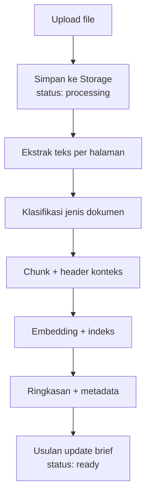

# Document Engine

Document Engine menerima file, mengekstrak teks per halaman, memecahnya jadi chunk berindeks, lalu menyajikannya ke AI lengkap dengan nomor halaman untuk sitasi. Semua langkah berjalan di **worker background**, jadi UI tetap responsif.

Setiap langkah **idempoten**. Jika gagal di tengah, job bisa diulang dari langkah terakhir tanpa data ganda. UI menampilkan status per dokumen (processing, ready, failed) beserta tombol coba lagi.

## Format dan library

| Format | Fase | Library Python | Catatan |
| --- | --- | --- | --- |
| PDF berteks | MVP | pypdf atau pdfplumber | Lisensi BSD dan MIT, aman untuk produk komersial |
| DOCX | MVP | python-docx | MIT |
| TXT dan MD | MVP | Bawaan Python | |
| PDF hasil scan | V1 | PDF support Claude (membaca visual halaman) | Lebih mahal; pakai hanya jika ekstraksi teks kosong |
| Artikel web | V1 | trafilatura | Simpan snapshot teks dan URL |
| Tabel dan layout rumit | V1 | Docling (MIT) | Lebih berat, jalankan di worker |

> [!warning] Lisensi
> Hindari PyMuPDF untuk produk closed-source kecuali membeli lisensi komersial, karena lisensi default-nya AGPL.

Batas awal: **20 MB dan 300 halaman per file.**

## Ekstraksi sesuai jenis dokumen

| Jenis | Yang diekstrak | Dipakai untuk |
| --- | --- | --- |
| Instruksi dosen, panduan kampus | Syarat, format, tanggal, rubrik | Brief, checklist syarat |
| Proposal | Rumusan masalah, tujuan, metode, jadwal | Brief, Plan Generator |
| Jurnal dan referensi | Judul, penulis, tahun, DOI, masalah, metode, dataset, hasil, keterbatasan | Tanya-jawab, sitasi, matriks literatur |
| Catatan bimbingan | Keputusan, permintaan revisi, tenggat | Memori project, usulan task |
| Draf naskah | Struktur bab, bagian yang belum ada | Checklist, umpan balik draf (V1) |

## Chunking dan embedding

- Potong mengikuti struktur (judul bagian), lalu paragraf. Target 300–800 token, overlap sekitar 10%.
- Setiap chunk menyimpan halaman awal dan akhir, jalur judul (misalnya "2.3 Metode > MCTS"), dan ID dokumen.
- Tambahkan header singkat sebelum embedding, berisi judul dokumen dan jalur judul bagian. Header ini membantu chunk pendek tetap bisa ditemukan.
- **Model embedding multilingual**, karena referensi bercampur bahasa Indonesia dan Inggris. Kandidat: Voyage AI, OpenAI, atau bge-m3 (open-source). Kebutuhan ini sejalan dengan [[Bilingual ID-EN]]: pertanyaan dalam satu bahasa harus bisa menemukan sumber dalam bahasa lain.
- **Cara memilih model:** uji 50 pertanyaan nyata yang jawabannya sudah diketahui, lalu ukur berapa yang jawabannya muncul di 8 chunk teratas.

## Retrieval

Retrieval hybrid: pencarian vektor (pgvector, indeks HNSW) + full-text search PostgreSQL, lalu peringkatnya disatukan dengan Reciprocal Rank Fusion.

$$\mathrm{RRF}(d) = \sum_{r \in \{\text{vektor},\,\text{teks}\}} \frac{1}{60 + \mathrm{rank}_r(d)}$$

- **Setiap query wajib difilter `project_id`**, sehingga dokumen project lain tidak pernah bocor ke jawaban.
- Ambil 8 chunk teratas untuk chat.
- Reranker baru ditambahkan di V1, dan hanya jika evals membuktikan peningkatannya.
- Full-text search PostgreSQL bergantung pada konfigurasi bahasa (`tsvector`). Untuk teks campuran Indonesia–Inggris, konfigurasi `simple` lebih aman daripada stemmer satu bahasa. Ini perlu diuji saat implementasi.

## Ringkasan dan literatur

- Setiap dokumen mendapat ringkasan maksimal 300 kata, disusun bertahap dari ringkasan per bagian. Ringkasan ini dipakai untuk pertanyaan luas seperti "metode apa yang paling sering dipakai di semua jurnal saya?".
- V1: metadata jurnal membentuk **matriks literatur** (paper × metode, dataset, hasil, celah) yang bisa diekspor ke Excel. Format sitasi APA dan IEEE memakai standar CSL, dan DOI divalidasi lewat API Crossref.

Terkait: [[AI Engine]] · [[Model Data]] · [[Tech Stack]]
