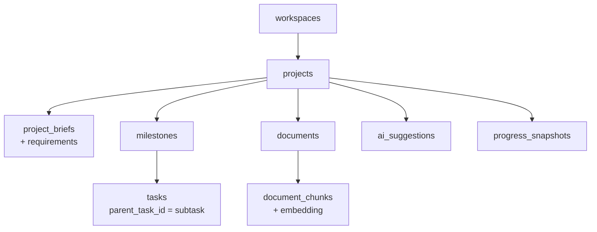

# Model Data

MVP butuh **21 tabel**, dikelompokkan per engine. Tabel `subscriptions` menyusul di V1. Setiap tabel milik pengguna membawa `workspace_id` atau terhubung ke project, dan setiap query difilter berdasarkan keanggotaan workspace.



Subtask memakai tabel `tasks` yang sama lewat kolom `parent_task_id`, dibatasi maksimal tiga level.

## Daftar tabel

| Tabel | Engine | Field kunci |
| --- | --- | --- |
| `profiles` | Platform | id (→ `auth.users` Supabase), nama, **locale**, timezone |
| `workspaces` | Platform | id, nama, owner_id, paket |
| `workspace_members` | Platform | workspace_id, user_id, role (owner, member, viewer) |
| `projects` | Project | id, workspace_id, mode, judul, deskripsi, target, deadline, kapasitas (jsonb), tanggal blokir, buffer_pct, health |
| `project_briefs` | Project | id, project_id, versi, isi (jsonb), sumber (ai/user) |
| `requirements` | Project | id, project_id, kode (R1), teks, dokumen sumber, status |
| `milestones` | Task | id, project_id, judul, urutan, target_date, status |
| `tasks` | Task | id, project_id, milestone_id, parent_task_id, judul, status, estimate_hours, actual_hours, priority_score, is_critical, optional, scheduled_start, scheduled_end, postpone_count, sumber, assignee_id |
| `task_dependencies` | Task | task_id, depends_on_id, tipe (FS) |
| `task_requirements` | Task | task_id, requirement_id |
| `documents` | Document | id, project_id, jenis, judul, storage_path, halaman, status, ringkasan, metadata (jsonb: penulis, tahun, DOI), checksum |
| `document_chunks` | Document | id, document_id, project_id, isi, halaman awal/akhir, jalur judul, embedding (vector), tsv (tsvector) |
| `notes` | Project | id, project_id, jenis (umum, bimbingan), isi, tanggal pertemuan |
| `project_memories` | AI | id, project_id, jenis (keputusan, masukan, batasan), isi, sumber, aktif |
| `progress_snapshots` | Insight | project_id, tanggal, planned_pct, actual_pct, spi, health |
| `activity_events` | Insight | id, project_id, aktor (user, ai, system), tipe, payload (jsonb), waktu |
| `notifications` | Insight | id, user_id, project_id, tipe, kanal, jadwal kirim, terkirim, dibaca |
| `ai_threads` | AI | id, project_id, user_id, judul, ringkasan bergulir |
| `ai_messages` | AI | id, thread_id, role, isi, sitasi (jsonb), tool_calls (jsonb), model, token masuk/keluar |
| `ai_suggestions` | AI | id, project_id, jenis (plan, replan, task_change, brief_update), diff (jsonb), alasan, status, waktu diputuskan |
| `usage_ledger` | AI | id, user_id, task_type, model, token masuk/keluar/cache, biaya (USD) |

**Dua bahasa:** `profiles.locale` menyimpan bahasa pilihan pengguna (`id` atau `en`). Nilai ini dipakai untuk UI, bahasa jawaban AI, email, dan notifikasi. Konten buatan pengguna (judul task, catatan) tidak diterjemahkan. Lihat [[Bilingual ID-EN]].

## Format diff pada Suggestion

```json
{
  "ops": [
    {"op": "update", "entity": "task", "id": "t_42",
     "fields": {"scheduled_end": "2026-11-12"}},
    {"op": "add", "entity": "task", "key": "new1",
     "fields": {"title": "Tambah 5 referensi terbaru di Bab 2",
                "estimate_hours": 4, "milestone_id": "m_1"}}
  ],
  "rationale": "Dosen meminta tambahan referensi pada bimbingan terakhir."
}
```

Pengguna bisa mencentang operasi satu per satu. Hasil keputusan tercatat di `activity_events`, sehingga riwayat perubahan rencana selalu bisa dilacak.

## Aturan data

- Primary key UUID; waktu disimpan sebagai `timestamptz` dalam UTC.
- Batas hari untuk jadwal memakai timezone pengguna (WIB, WITA, WIT).
- Project yang dihapus masuk tempat sampah 30 hari. Penghapusan akun menghapus permanen semua data, file, dan embedding milik pengguna.
- Semua perubahan skema lewat migrasi Alembic. Tidak ada perubahan manual di database production.
- Row Level Security Supabase menjadi lapis kedua di belakang pengecekan akses di FastAPI. Lihat [[Keamanan dan Privasi]].

Terkait: [[Tech Stack]] · [[API]] · [[Planning Engine]] · [[Document Engine]]
