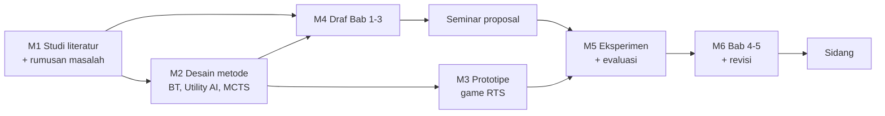

# Planning Engine

Planning Engine mengubah struktur kerja dari AI menjadi jadwal yang realistis, lalu memantau apakah jadwal itu masih tercapai. **Semua perhitungannya deterministik, tanpa panggilan LLM, dan wajib punya unit test.** Modul `planning` sengaja dibuat tanpa akses database atau jaringan. Input dan output-nya data biasa, jadi ribuan kasus bisa diuji dalam hitungan detik.

## Siapa mengerjakan apa

| Langkah | Dikerjakan oleh |
| --- | --- |
| Memecah project jadi milestone, task, subtask | LLM |
| Estimasi awal jam per task | LLM, dikoreksi data pengguna |
| Menentukan dependensi | LLM mengusulkan, kode memvalidasi |
| Menghitung tanggal, jalur kritis, kapasitas | Kode |
| Menghitung health score | Kode |
| Menjelaskan jadwal dan opsi re-plan | LLM |

Alasannya: LLM sering salah menghitung tanggal dan kapasitas.

## Kontrak output Plan Generator

LLM mengirim struktur **tanpa tanggal**. Field `requirement_refs` menautkan task ke syarat di brief. Tautan inilah yang menggerakkan checklist syarat.

> [!important] Kunci kontrak ini lebih dulu
> Menurut [[Knowledge Graph]], kontrak inilah yang paling banyak dipakai bagian lain: scheduler, checklist syarat, Suggestion, pertanyaan terbuka, dan kalibrasi. Tetapkan schema Pydantic-nya dan beri nomor versi sebelum kode di sekitarnya dibangun. Nama field tetap English. Isi teks (`title`, `definition_of_done`, `questions`) mengikuti bahasa pengguna ([[Bilingual ID-EN]]).

```json
{
  "milestones": [{"key": "M1", "title": "Studi literatur dan rumusan masalah"}],
  "tasks": [{
    "key": "T1", "milestone": "M1",
    "title": "Kumpulkan 25 jurnal decision-making NPC 2020-2026",
    "estimate_hours": 6, "depends_on": [], "optional": false,
    "definition_of_done": "25 PDF masuk library dan terindeks",
    "requirement_refs": ["R1"]
  }],
  "assumptions": ["Prototipe dibuat dengan Unity"],
  "questions": ["Engine game apa yang dipakai untuk prototipe?"]
}
```

## Algoritma scheduler (MVP)

**Input:** struktur kerja, deadline dan tanggal penting, kapasitas jam per hari untuk tiap hari dalam seminggu, tanggal blokir (UTS, UAS, libur), buffer default 15%.

1. **Validasi graf** dengan algoritma Kahn (topological sort). Graf bersiklus ditolak.
2. **Jalur kritis:** rantai dependensi dengan total estimasi terpanjang.
3. **Backward pass:** batas selesai paling lambat setiap task, dihitung dari deadline dikurangi buffer.
4. **Forward pass berbasis kapasitas:** isi slot hari kerja mulai hari ini dalam urutan topologis, slack terkecil didahulukan.
5. **Cek kelayakan:** jika total jam melebihi kapasitas sebelum deadline, laporkan kekurangan jamnya dan tawarkan opsi re-plan.

**Output per task:** tanggal mulai dan selesai terjadwal, penanda kritis, slack. **Output per project:** laporan kelayakan.

Batas hari memakai timezone pengguna (WIB, WITA, WIT). Lihat [[Model Data]].

## Skor prioritas

$$P = 0.4\,K + 0.3\,(1 - S_n) + 0.2\,D_n + 0.1\,U$$

- $K$ = 1 jika task ada di jalur kritis.
- $S_n$ = slack yang dinormalisasi ke 0–1.
- $D_n$ = jumlah task yang menunggu task ini (dinormalisasi).
- $U$ = penilaian penting dari pengguna (0; 0,5; 1).

Bobot di atas adalah nilai awal, disetel ulang setelah beta.

## Progress dan health score

Progress dihitung dengan bobot jam estimasi, sehingga task 10 jam lebih berpengaruh daripada task 1 jam.

$$\mathrm{SPI} = \frac{\text{jam task selesai}}{\text{jam task yang dijadwalkan selesai sampai hari ini}}$$

Contoh: hari ini seharusnya 40% jam kerja selesai, kenyataannya 30%. SPI = 0,75, jadi statusnya At Risk.

| Status | Syarat |
| --- | --- |
| On Track | SPI ≥ 0,90 dan tidak ada task kritis terlambat |
| At Risk | SPI 0,75 sampai < 0,90, atau task kritis terlambat 1–3 hari |
| Off Track | SPI < 0,75, task kritis terlambat > 3 hari, atau jadwal tidak layak |

Selama rencana baru berjalan di bawah 5%, SPI belum stabil. Pada masa itu status hanya memakai aturan task terlambat.

## Re-plan

**Pemicu:** status turun, task kritis lewat tenggat, deadline atau kapasitas berubah, syarat baru dari log bimbingan, atau task yang sama ditunda dua kali. Untuk task yang ditunda dua kali, AI menawarkan pecah task jadi langkah 25 menit.

**Alur:** scheduler menyimulasikan beberapa opsi → LLM menjelaskan untung-ruginya → pengguna memilih → diff diterapkan.

| Opsi | Contoh |
| --- | --- |
| Tambah kapasitas | Tambah 3 jam per minggu selama 4 minggu |
| Geser task non-kritis | Pindahkan task dengan slack besar ke minggu depan |
| Kurangi scope | Tandai task opsional (misalnya eksperimen tambahan) sebagai nanti |
| Mundurkan target internal | Geser target seminar proposal jika aturan kampus mengizinkan |

## Contoh rencana: penelitian NPC game RTS



Eksperimen baru bisa dimulai setelah seminar proposal lolos dan prototipe siap. Karena itu keduanya kandidat jalur kritis.

## Kalibrasi estimasi (V1)

Setelah pengguna mencatat waktu lewat focus session, sistem menghitung faktor kecepatan pribadi, yaitu median dari jam aktual dibagi jam estimasi. Estimasi task baru dikalikan faktor ini, sehingga jadwal makin akurat setiap minggu.

## Testing

Property-based testing dengan Hypothesis. Aturan yang selalu harus benar: task tidak dimulai sebelum dependensinya selesai, jam per hari tidak melebihi kapasitas, dan rencana yang layak selalu selesai sebelum deadline. Lihat [[Testing dan Evals]].

Terkait: [[AI Engine]] · [[Siklus Project Adaptif]] · [[Model Data]] · [[Langkah Pertama 14 Hari]]
