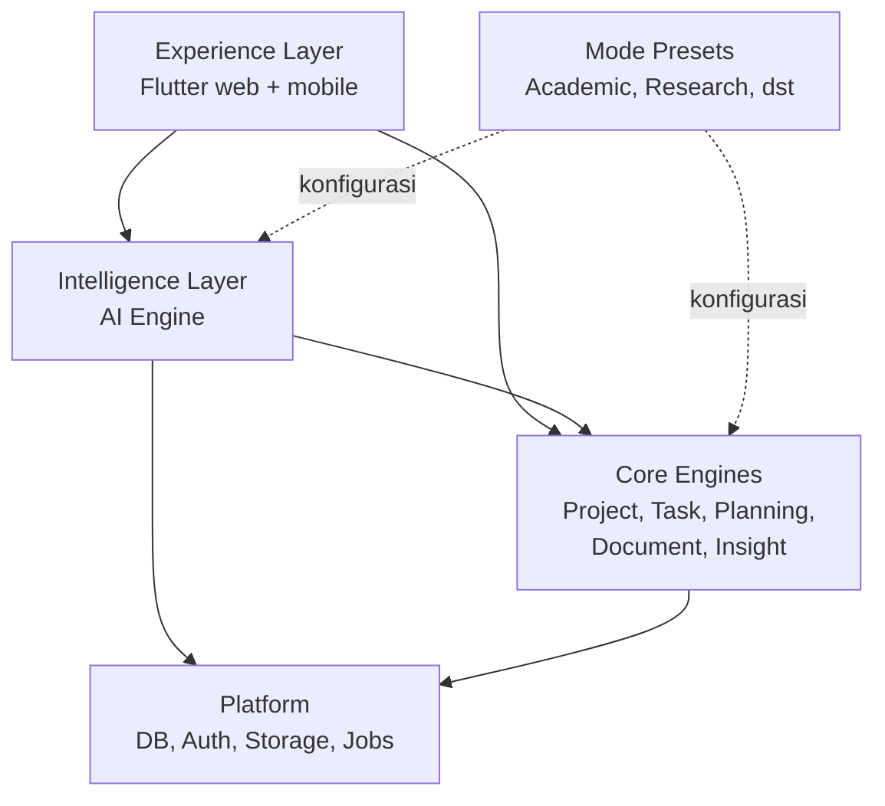

# Struktur Sistem

Diagram awal sudah tepat memisahkan engine dan mode. Master plan merevisinya di tiga hal:
1. AI Engine naik menjadi lapisan tersendiri (Intelligence Layer) yang melayani semua engine.
2. Ada dua engine baru: Context Engine dan Insight & Notification Engine.
3. Lima mode berubah menjadi preset di atas satu inti. Lihat [[Mode sebagai Preset]].

UI memanggil Core Engines untuk data biasa dan Intelligence Layer untuk fitur AI. Mode hanya menyuntikkan konfigurasi ke keduanya.

## Komponen per lapisan

| Lapisan | Komponen | Tanggung jawab | Catatan |
| --- | --- | --- | --- |
| Experience | Web app, mobile app | UI, notifikasi, capture cepat | [[Alur dan Layar]] |
| Experience | Mode Presets | Template, istilah, persona AI, fitur khusus | [[Mode sebagai Preset]] |
| Intelligence | Context Engine | Merakit konteks project untuk setiap panggilan AI | [[AI Engine]] |
| Intelligence | AI Workflows | Intake, planner, tanya-jawab, coach, review mingguan | [[AI Engine]] |
| Intelligence | Model Gateway | Pilih model, retry, kuota, pencatatan biaya | [[AI Engine]] |
| Intelligence | Guardrails dan Evals | Validasi output, tangkal prompt injection, uji kualitas | [[AI Engine]], [[Testing dan Evals]] |
| Core | Project Engine | Project, brief, anggota, mode, pengaturan | [[Model Data]] |
| Core | Task Engine | Milestone, task, subtask, dependensi, status | [[Model Data]] |
| Core | Planning Engine | Scheduler, health score, simulasi re-plan | [[Planning Engine]] |
| Core | Document Engine | Upload, parsing, indeks, pencarian, metadata referensi | [[Document Engine]] |
| Core | Insight & Notification Engine | Snapshot progress, deteksi tertinggal, pengingat, digest | [[Alur dan Layar]] |
| Platform | Auth, Storage, Jobs, Billing, Analytics | Layanan dasar bersama | [[Tech Stack]] |

## Modular monolith

Setiap engine berupa modul Python di satu backend. Antarmodul hanya saling memanggil lewat **fungsi publik (service layer)**. Dengan begitu modul bisa dipisah jadi layanan sendiri kalau suatu saat perlu. Satu backend cukup untuk satu developer.

Terkait: [[Tech Stack]] · [[AI Engine]] · [[Planning Engine]] · [[Document Engine]]
