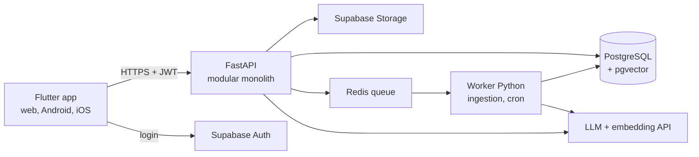

# Tech Stack

Stack utama: **Flutter** untuk semua UI, **FastAPI (Python)** untuk backend dan AI, **Supabase** untuk database, login, dan file. Flutter dan Python sudah pernah dipakai, jadi energi bisa fokus ke produk.



API melayani permintaan cepat dan chat streaming. Worker mengerjakan tugas berat: ingestion dokumen, cek health harian, dan pengiriman pengingat.

## Pilihan per lapisan

| Lapisan | Pilihan | Alasan | Alternatif |
| --- | --- | --- | --- |
| UI web dan mobile | Flutter, Riverpod, go_router, Dio, freezed | Satu codebase untuk tiga platform | Next.js untuk web + Flutter untuk mobile |
| i18n | Flutter gen-l10n dengan file ARB `id` dan `en` | Bawaan Flutter, sudah direncanakan sejak awal | — |
| Landing page | Situs statis (Astro atau website builder) | SEO; Flutter web lemah untuk SEO | — |
| API | FastAPI, Pydantic v2, SQLAlchemy 2, Alembic | Validasi tipe kuat, async, OpenAPI otomatis | Django + DRF |
| Worker | Celery atau ARQ, dengan Redis | Job ingestion, cron harian, retry | Dramatiq |
| Database | PostgreSQL di Supabase + pgvector | Data relasional dan vektor di satu tempat | Neon |
| Auth | Supabase Auth (email, Google) | SDK Flutter resmi; FastAPI cukup memverifikasi JWT | Firebase Auth |
| File | Supabase Storage dengan signed URL | Satu platform dengan database | Cloudflare R2 |
| LLM | Claude API lewat Model Gateway | Citations, prompt caching, batch | Provider lain lewat gateway |
| Email | Resend atau Brevo | API sederhana | — |
| Push (V1) | Firebase Cloud Messaging | Standar di Flutter | — |
| Observability | Sentry, PostHog, Langfuse | Error, analitik produk, tracing LLM | — |
| Pembayaran (V1) | Midtrans atau Xendit | QRIS, e-wallet, virtual account | — |

**Catatan Flutter web:** unduhan awalnya besar dan SEO-nya lemah. Karena aplikasi berada di balik login, cukup buat landing page terpisah dan tampilkan layar loading ringan. Landing page juga perlu dua bahasa. Lihat [[Bilingual ID-EN]].

## Struktur repo (monorepo, rencana)

```text
rampung/
├── app/                     # Flutter (web + mobile)
│   └── lib/
│       ├── core/            # tema, router, api client, auth, l10n
│       ├── features/        # project, task, plan, documents, chat, insight
│       └── shared/          # widget umum
├── backend/
│   ├── app/
│   │   ├── api/v1/          # router FastAPI, lapisan tipis
│   │   ├── modules/
│   │   │   ├── projects/    # service, repository, schemas
│   │   │   ├── tasks/
│   │   │   ├── planning/    # scheduler + health, Python murni tanpa I/O
│   │   │   ├── documents/
│   │   │   ├── insight/
│   │   │   └── ai/          # gateway, context, workflows, prompts
│   │   ├── core/            # config, db, auth, logging
│   │   └── workers/         # job background dan cron
│   ├── migrations/          # Alembic
│   └── tests/
├── modes/                   # YAML preset mode + template project
├── evals/                   # dataset dan skrip evals AI
└── docs/adr/                # catatan keputusan arsitektur
```

> [!info] Kondisi repo sekarang (2026-09-25)
> Struktur di atas sudah terisi kode. Bedanya dengan rencana: `lib/` memakai `core/`, `data/`, `features/`, dan `l10n/` (tanpa `shared/`), backend punya modul `accounts/` dan `modes/`, dan belum ada `workers/` karena pemrosesan dokumen memakai `BackgroundTasks`. Package Flutter sudah bernama `purnara`. Git masih lokal tanpa remote.

## Versi lokal sekarang

Stack di atas adalah target produksi. Untuk sekarang semuanya punya versi lokal gratis, dan versi produksinya dipasang lewat konfigurasi (ADR-0002, `docs/adr/0002-pengembangan-lokal-tanpa-biaya.md`).

| Kebutuhan | Sekarang | Nanti |
| --- | --- | --- |
| Database dan file | SQLite + folder lokal di `backend/data/` | Supabase Postgres + Storage |
| Login | Mode `local`: satu pengguna | Supabase Auth |
| Pemrosesan dokumen | `BackgroundTasks` FastAPI | Worker + Redis |
| Pencarian dokumen | BM25 + perluasan istilah ID↔EN | BM25 + pgvector, digabung RRF |
| AI | Opsional; versi dasar tanpa AI | Claude lewat Model Gateway |
| Hosting | Backend melayani API dan build web di port 8000 | Cloud (tabel Deployment di bawah) |

Catatan implementasi:
- **Material dari package `material_ui`.** Sejak Flutter 3.47 Material dipisah dari framework, dan go_router 18 memakainya. Aplikasi mengimpor `package:material_ui/material_ui.dart`.
- **freezed dan client OpenAPI ditunda.** Model data Dart ditulis tangan sampai API stabil; kontraknya dijaga test API dan test widget.
- Pengembangan memakai **VS Code**; konfigurasi run, task, dan ekstensi ada di `.vscode/`.

Rencananya client Dart di-generate dari spesifikasi OpenAPI FastAPI, supaya model data di Flutter selalu sama dengan backend (ditunda, lihat di atas). Lihat [[API]].

## Deployment

| Komponen | Tempat | Region |
| --- | --- | --- |
| Flutter web | Cloudflare Pages atau Firebase Hosting | CDN global |
| FastAPI dan worker (Docker) | Railway, Render, atau Fly.io | Singapura |
| Database, Auth, Storage | Supabase | Singapura |
| Redis | Upstash atau add-on platform | Singapura |

Ada tiga lingkungan: **lokal** (Supabase CLI + Docker), **staging**, dan **production**, masing-masing dengan kunci API terpisah. Paket gratis Supabase cukup untuk development. Production memakai paket berbayar agar tidak dijeda dan punya backup.

Terkait: [[Struktur Sistem]] · [[Model Data]] · [[API]] · [[Operasional]]
