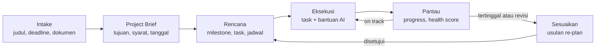

# Siklus Project Adaptif

Seluruh produk berputar di satu siklus. **Project Context** menjadi ingatan bersama antara pengguna dan AI. Setiap fitur harus memperkuat salah satu langkah di siklus ini.

Panah balik dari **Pantau** ke **Rencana** membedakan Purnara dari to-do list biasa. Rencana berubah mengikuti kenyataan, dan setiap perubahan menunggu persetujuan pengguna.

| Langkah | Dikerjakan oleh | Catatan detail |
| --- | --- | --- |
| Intake → Brief | Workflow Intake dan Brief | [[AI Engine]] |
| Brief → Rencana | Plan Generator (LLM) + scheduler (kode) | [[Planning Engine]] |
| Eksekusi | Task Helper, Project Chat | [[AI Engine]], [[Alur dan Layar]] |
| Pantau | Health score, pengingat | [[Planning Engine]], Insight & Notification Engine di [[Struktur Sistem]] |
| Sesuaikan | Re-plan: simulasi scheduler + penjelasan LLM | [[Planning Engine]] |

## Project Context: enam lapisan

| Lapisan | Isi | Diperbarui oleh | Masuk ke prompt AI |
| --- | --- | --- | --- |
| Project Brief | Tujuan, deliverable, syarat dosen, batasan, tanggal penting | AI mengekstrak, pengguna menyetujui | Selalu, versi ringkas |
| Plan State | Milestone, task, status, dependensi, jadwal | Pengguna dan scheduler | Selalu, snapshot ringkas |
| Knowledge | Potongan dokumen dan ringkasan per dokumen | Document Engine | Sesuai pertanyaan (retrieval) |
| Project Memory | Keputusan, masukan dosen, perubahan arah | AI dari catatan, pengguna | Item yang relevan |
| Riwayat aktivitas | Task selesai, ditunda, pola kerja | Sistem | Ringkasan 7 hari terakhir |
| Percakapan | Pesan terakhir dan ringkasan bergulir | Sistem | Dibatasi jumlah token |

## Brief = sumber kebenaran tunggal

Pengguna bisa mengedit brief kapan saja, dan setiap edit tersimpan sebagai versi baru (`project_briefs.versi`).

Contoh brief hasil ekstraksi, untuk persona Raka:

| Field | Isi |
| --- | --- |
| Tujuan | Merancang dan menguji model decision-making NPC pada game RTS sederhana |
| Deliverable | Proposal, prototipe game, naskah Bab 1–5, artikel jurnal |
| Syarat dosen | Misalnya minimal 20 referensi 5 tahun terakhir, format sitasi IEEE |
| Tanggal penting | Seminar proposal, sidang (deadline) |
| Batasan | 10 jam per minggu |
| Pertanyaan terbuka | Metode pembanding apa: Behavior Tree, Utility AI, atau MCTS? |

Baris **Pertanyaan terbuka** penting. AI menulis apa yang belum ia ketahui dan menanyakannya ke pengguna, alih-alih menebak.

Terkait: [[Prinsip Produk]] · [[Fitur MVP V1 V2]] · [[Model Data]]
