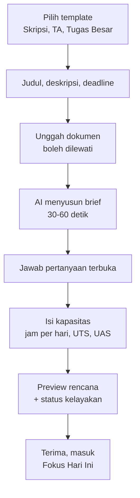

# Alur dan Layar

Ada dua target UX:
- **Pengguna baru** punya rencana siap pakai dalam **10 menit**.
- **Pengguna lama** cukup **2 menit sehari** untuk tahu apa yang harus dikerjakan.

## Onboarding

Setiap langkah bisa dilewati dan dilengkapi nanti. Selama AI bekerja, layar menampilkan progres per dokumen agar pengguna tahu sistem tidak macet.

Pemilihan bahasa sebaiknya terjadi sebelum langkah pertama. Default-nya mengikuti bahasa perangkat, dan bisa diubah di Pengaturan. Lihat [[Bilingual ID-EN]].

## Peta layar MVP

| Layar | Tujuan | Aksi utama |
| --- | --- | --- |
| Fokus Hari Ini (beranda) | Tahu yang dikerjakan hari ini | Tandai progress |
| Project Overview | Health, milestone berikutnya, insight AI | Buka usulan re-plan |
| Plan (List, Board, Timeline) | Kelola task | Ubah status, geser jadwal |
| Task Detail | Kerjakan satu task | Pecah task, Bantu saya mulai |
| Review Brief | Cek hasil ekstraksi AI | Setujui atau edit |
| Library Dokumen | Dokumen, ringkasan, status proses | Unggah, tanya dokumen |
| Panel AI | Tanya jawab berbasis konteks | Kirim pertanyaan |
| Log Bimbingan | Catat pertemuan dengan dosen | Ubah jadi task revisi |
| Review Mingguan | Refleksi dan rencana minggu depan | Terima penyesuaian |
| Pengaturan | Kapasitas, notifikasi, akun, data, **bahasa** | Ubah jam kerja |

## Loop harian dan mingguan

- **Harian:** buka Fokus Hari Ini (maksimal 3 task utama, deadline terdekat, status health), kerjakan, lalu tandai progress dengan satu tap. Saat buntu, tekan *Bantu saya mulai*, dan AI memberi langkah pertama 25 menit.
- **Mingguan:** Minggu malam, review mingguan merangkum yang selesai, yang tertinggal, dan usulan penyesuaian. Pengguna menerima usulan, lalu minggu baru dimulai dengan rencana segar.

## Pengingat

| Pengingat | Waktu | Kanal |
| --- | --- | --- |
| Digest fokus hari ini | Jam pilihan pengguna, default 07.00 | Email (MVP), push (V1) |
| Deadline mendekat | H-7, H-3, H-1 | Email, in-app |
| Status health turun | Saat terjadi, maksimal sekali sehari | In-app, email |
| Review mingguan | Minggu 19.00 | In-app, email |

Jam tenang default 22.00–06.00. Setiap jenis pengingat bisa dimatikan terpisah. Target opt-out ada di [[Metrik]].

## Prinsip UI

- Satu aksi utama per layar, dengan hierarki visual yang jelas.
- Setiap layar punya desain untuk state loading, kosong, error, dan sukses, termasuk *AI sedang streaming* dan *AI gagal* (dengan tombol coba lagi).
- Kartu usulan AI berlabel jelas. Diff ditampilkan dengan ikon dan teks, bukan warna saja, plus tombol **Terima semua**, **Pilih**, dan **Tolak**.
- Kontras teks minimal WCAG AA, target sentuh minimal 44 × 44 px, desain mobile-first.
- Maksimal dua keluarga font, skala 12, 14, 16, 20, 24, 32.
- Teks English rata-rata lebih pendek dari Indonesia, tapi tidak selalu. Layout harus tahan teks yang lebih panjang di kedua bahasa. Lihat [[Bilingual ID-EN]].

## Peran web dan mobile

| Platform | Peran | Fitur prioritas |
| --- | --- | --- |
| Web (laptop) | Kerja mendalam | Intake, library dokumen, timeline, chat panjang, review mingguan |
| Mobile | Cek cepat dan pengingat | Fokus Hari Ini, update progress 1 tap, notifikasi, catat bimbingan, tanya AI singkat |

Terkait: [[Fitur MVP V1 V2]] · [[Prinsip Produk]] · [[Bilingual ID-EN]]
